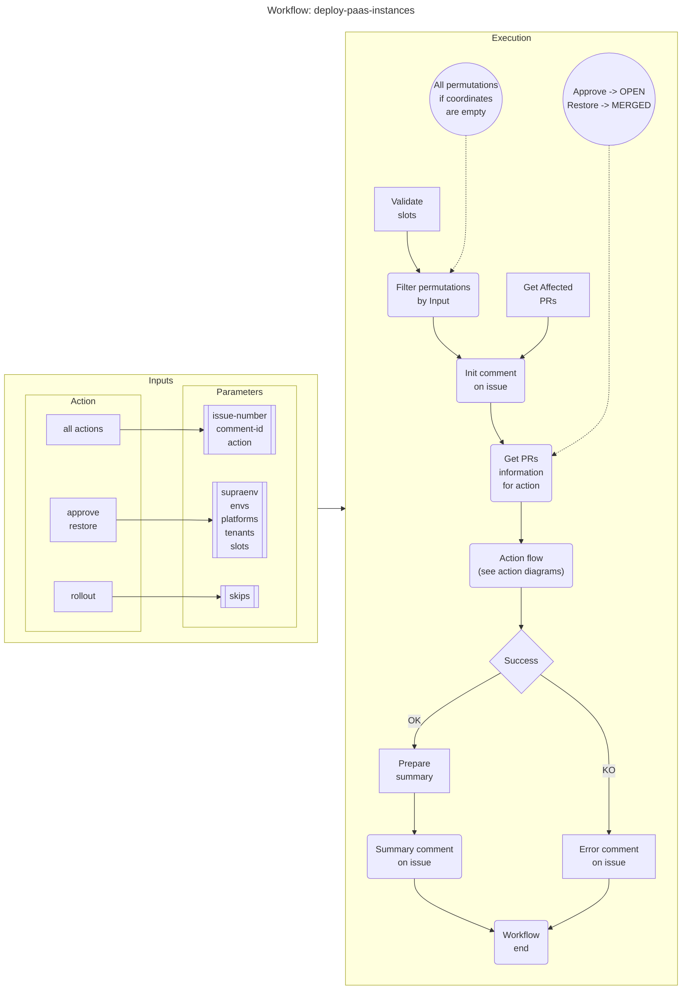
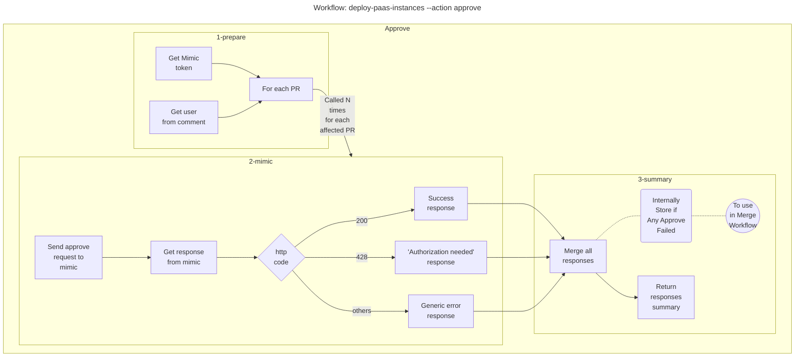
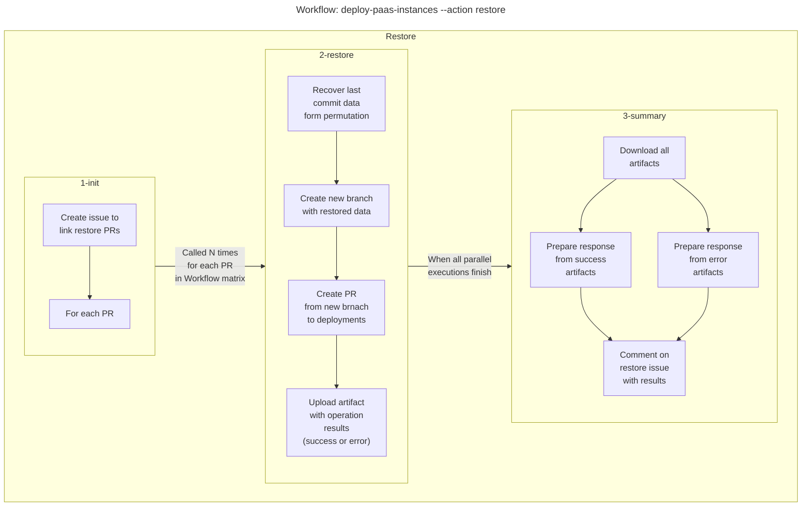

# paas-deploy-instances

[`paas-deploy_instances.yml`](../paas-deploy_instances.yml) workflow manages the deployment of several permutations at the same time.

## Trigger

`workflow_dispatch` from a `issue` with ChatBot. See [`/deploy-paas-instances`](https://chatbot.docs.inditex.dev/chatbot/latest/commands/deploy-paas-instances.html) documentation.

## Where does it run?

`ubuntu-20.04` GitHub cloud runner.

## Diagrams fot the workflow and actions

### deploy-paas-instances workflow

### Approve action

### Merge action

```mermaid
---
title: "Workflow: deploy-paas-instances --action merge"
---
flowchart LR
    subgraph Merge
        direction LR
        A --> C
        B --> C
        P --> |"NO"| Z
        I --> J --> K
        G --> J
        H --> J
        subgraph 2-prepare
            Z["
                Start Mimic
                Operations
            "]
            A["
                Get Mimic
                token
            "]
            B["
                Get user
                from comment
            "]
            C["For each PR"]
        end
        C --> 3-approve
        Z --> A
        Z --> B
        subgraph 4-merge
            D --> E
            E --> F
            F --> |others| G
            F --> |428| H
            F --> |200| I
            D["
                Send Merge
                request to
                mimic
            "]
            E["
                Get response
                from mimic
            "]
            F{"
                http
                code
            "}
            G["
               Generic error
               response
            "]
            H["
                'Authorization needed'
                response
            "]
            I["
                Success
                response
            "]
        end
        subgraph 5-summary
            J["
                Merge all
                responses
            "]
            K["
                Return
                responses
                summary
            "]
        end
        subgraph 1-verify
            subgraph internal-verification
            direction LR
                L["
                    Check if 
                    review by codeowner
                    Required
                "]
                M["
                    Check if user
                    is codeowner
                "]
                N["
                    User has permissions
                "]
                O["
                    User in any
                    codeowner 
                    Group
                "]
                    OP["
                    User 
                    doesn't have 
                    permissions
                "]
            end
            P["
                Check if any
                missing permissions
                in any PR 
            "]
            P["
                Check if missing 
                permissions
                in any PR 
            "]
            Q["
                Break full workflow
            "]
            L --> |"yes"| N
            L --> |"no"| M
            M --> |"yes"| N
            M --> |"no"| O
            P --> |"yes"| Q
            P -.- |"Internally"| internal-verification
            O --> |"no"| OP
            O --> |"yes"| N
            Q --> |"Send error"| K
        end
        subgraph 3-approve
        R["
                Execute Regular
                approve workflow
        "]
        S["
                Any error
        "]
        T["
                Successful
        "]
        end
        R --> S
        R --> T
        S --> |"Send error"| K
        T -->  D
    end

```

### Restore action

