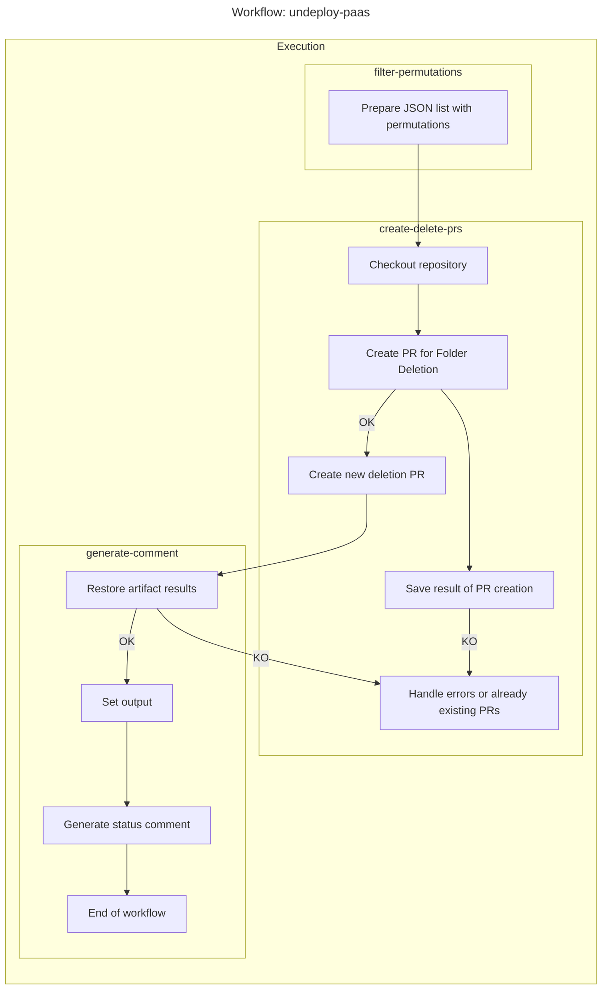

# undeploy-paas

[undeploy-paas.yml](../undeploy-paas.yml) workflow manages the deletion of several deployment permutations at the same time.

## Trigger

`workflow_dispatch` from a `issue` with ChatBot. See [`/undeploy-paas`](https://chatbot.docs.inditex.dev/chatbot/latest/commands/delete-paas-instances.html) documentation.

## Where does it run?

`ubuntu-24.04` GitHub cloud runner.

## Diagrams for the workflow and actions

### undeploy-paas workflow

