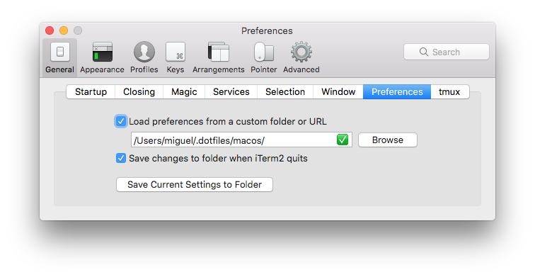
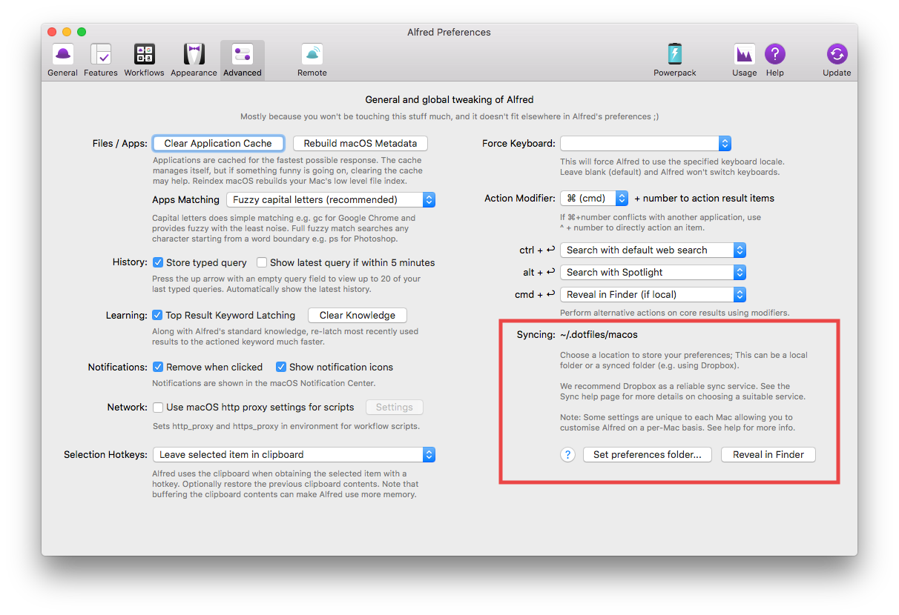

# MacOS

## iTerm 3.4

To restore the preferences for iTerm2 (version ≥ 3.3):

* Open the Preferences dialog in iTerm2
* Go to the General->Preferences tab  
* Enter `$DOTFILES_ROOT/macos` under _Load preferences from a custom folder or URL_:

## Alfred 2

